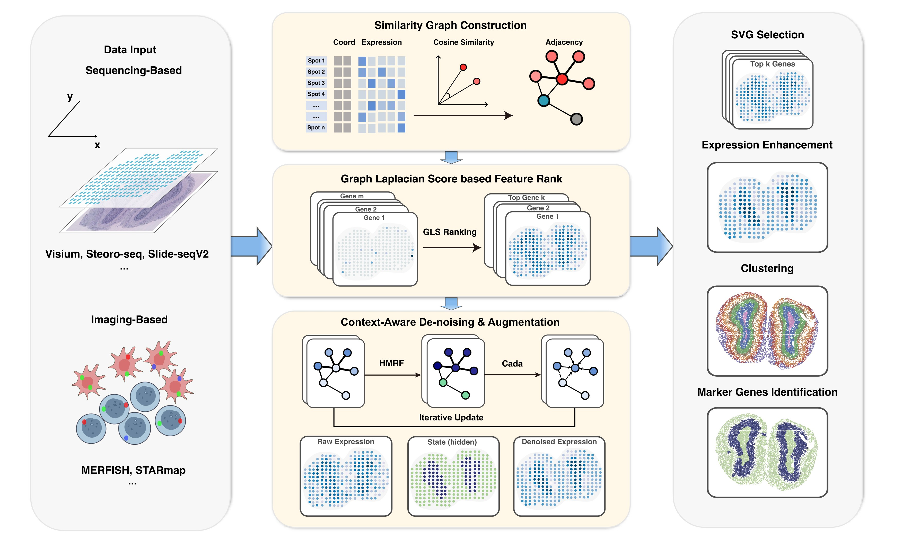

# Probabilistic-Graph Based Spatial Context-Aware Framework for Interpretable Spatial Omics Denoising and Augmentation

## Description



This project is a python implementation of **CadaST**, a spatial omics data denoising and augmenting method based on similarity graph. The method is proposed in the paper **Probabilistic-Graph Based Spatial Context-Aware Denoising and Augmenting in Spatial Omics**.
The method is implemented in the class `CadaST` in `model.py`.


## Installation

Use pip to install the package in your python environment.
```bash
conda create -n CadaST python=3.10
conda activate CadaST
pip install cadast
```

To enable clustering method 'mclust', you shall install R package 'mclust'
```bash
pip install rpy2
Rscript -e "install.packages('mclust')"
```

## Usage
To get detailed tutorial, please refer to the [tutorial](./tutorial/).

### Parameters

- beta $\beta$: The scaling weight for the similarity graph.
- alpha $\alpha$: The scaling weight for correlation matrix.
- theta $\theta$: The decay value for non-matching labels in the label matrix.
- n_jobs: The number of processes used for parallel computing.
- kneighbors: The k-Nearest Neighbors to construct graph.

## Contributing

Contribution is welcomed! Here’s how you can help:
- Report bugs or suggest features using [GitHub Issues](https://github.com/Khadaq2001/CadaST/issues).
- Fork the repository and create a new branch for your feature or bugfix.
- Submit a pull request and ensure that all tests pass.

## License

This project is licensed under the MIT License - see the [LICENSE](LICENSE) file for details.
